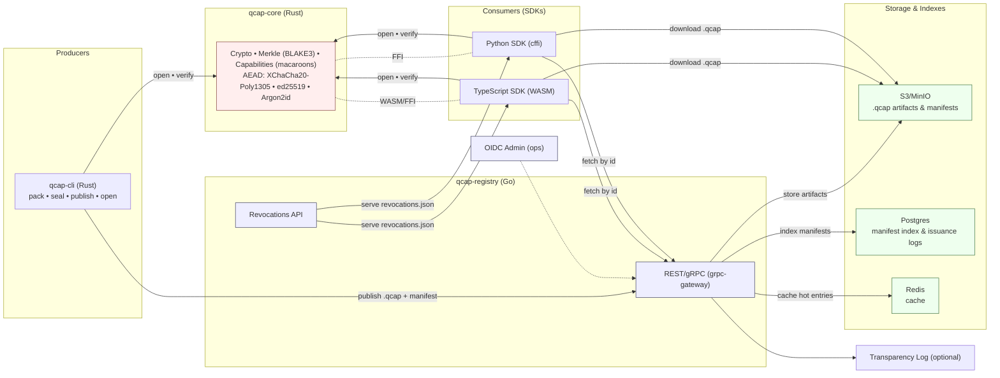

# Q-Cap

*Q-Cap* (Capability-based, encryptable content packages) is a packaging and distribution format that lets you **publish data openly** while keeping access **cryptographically controlled** by capabilities. Think: `.qcap` files that travel and sync like regular artifacts, but decrypt only for holders of the right capability tokens.

> Status: **alpha scaffold** — this repository currently includes a Rust core library and CLI demo, a minimal Go registry service, and a TypeScript SDK stub. The full MVP (pack/seal/open/verify/capabilities/registry) is being built in milestones.

---

## Why Q-Cap?

* **Confidentiality-by-default**: Envelope encryption per file with modern Authentication Encryption with Associated Data (AEAD).
* **Least-privilege sharing**: Capability tokens (macaroons) with caveats (expiry, paths, audience).
* **Integrity & provenance**: BLAKE3 Merkle tree; signed manifest.
* **Portable**: Single-file `.qcap` artifact; easy to mirror/cdn.
* **Ecosystem-friendly**: SDKs for TypeScript and Python; registry with S3/MinIO.

---

## Repo structure

```
q-cap/
  core/
    qcap-core/       # Rust library (crypto & format building blocks)
    qcap-cli/        # Rust CLI (demo cmd available today)
  services/
    qcap-registry/   # Go minimal registry (health check endpoint)
  sdks/
    ts/              # TypeScript SDK stub
  api/
    proto/           # Protobuf IDL (stub)
  .github/workflows/ # CI
  docs/              # Project docs (stubs)
```

---

## Architecture (at a glance)



---

## Getting started

### Prerequisites

* **Git** and **GitHub CLI** (`gh auth login`)
* **Rust** (stable, MSVC on Windows)
* **Go** 1.21+
* **Node.js** (optional, for building the TS SDK)

#### Install on Windows (PowerShell)

```powershell
winget install Rustlang.Rustup
# If needed:
winget install Microsoft.VisualStudio.2022.BuildTools --silent --override "--add Microsoft.VisualStudio.Workload.VCTools --includeRecommended --passive --norestart"
winget install GoLang.Go
```

#### Install on macOS (Homebrew)

```bash
brew install rustup-init go gh node
rustup-init -y
gh auth login
```

> After installing Rust, restart your shell or add `~/.cargo/bin` (Windows: `%USERPROFILE%\.cargo\bin`) to your PATH.

---

## Clone & build

```bash
git clone https://github.com/<YOUR_OWNER>/q-cap
cd q-cap
cargo build --workspace
```

### Quick demo (CLI)

The demo subcommand just computes a BLAKE3 “root” over input bytes:

```bash
cargo run -p qcap-cli -- hash "hello world"
# -> blake3:7d8d... (hash will vary)
```

### MVP demo: sealed package, capability, registry

The current MVP demonstrates the core Q-Cap flow locally:

1. Generate issuer and recipient identities.
2. Seal a payload directory into an encrypted `.qcap`.
3. Include a generated sample GeoPackage at `reports/observations.gpkg`.
4. Publish and fetch it through the local registry.
5. Prove open fails without a capability.
6. Grant a capability for `reports/*`.
7. Open only the authorized payload path and verify the GeoPackage exports unchanged.

On Windows PowerShell:

```powershell
.\scripts\demo.ps1
```

Manual equivalent:

```bash
cargo run -p qcap-cli -- init --name issuer --out /tmp/qcap-demo/issuer.identity.json
cargo run -p qcap-cli -- init --name recipient --out /tmp/qcap-demo/recipient.identity.json
cargo run -p qcap-cli -- sample-geopackage --out /tmp/qcap-demo/payload/reports/observations.gpkg
cargo run -p qcap-cli -- seal /tmp/qcap-demo/payload --issuer /tmp/qcap-demo/issuer.identity.json --recipient /tmp/qcap-demo/recipient.identity.json --out /tmp/qcap-demo/demo.qcap
QCAP_REGISTRY_SEED=/tmp/qcap-demo/registry go run services/qcap-registry/main.go
cargo run -p qcap-cli -- publish /tmp/qcap-demo/demo.qcap --registry http://127.0.0.1:8080
cargo run -p qcap-cli -- fetch demo.qcap --out /tmp/qcap-demo/fetched.qcap --registry http://127.0.0.1:8080
cargo run -p qcap-cli -- grant /tmp/qcap-demo/fetched.qcap --issuer /tmp/qcap-demo/issuer.identity.json --audience <recipient-id> --path "reports/*" --out /tmp/qcap-demo/cap.json
cargo run -p qcap-cli -- open /tmp/qcap-demo/fetched.qcap --cap /tmp/qcap-demo/cap.json --identity /tmp/qcap-demo/recipient.identity.json --out /tmp/qcap-demo/exported
```

This is an MVP, not a hardened security product. It uses XChaCha20-Poly1305 for file encryption, X25519-derived wrapping keys for recipients, ed25519 signatures over the Merkle root, and signed capability tokens with enforced expiry, audience, and path constraints.

### Run the registry (dev)

You can seed demo capsules and run the registry locally. It exposes:

* `/` — HTML landing page with links
* `/health` — JSON status
* `/health.html` — HTML status page
* `/index.json` — JSON list of seeded `.qcap` artifacts
* `/index` — HTML index listing
* `/artifacts/<name>` — static download of seeded artifacts

Quick start:

```bash
# Seed demo artifacts (alpha.qcap, beta.qcap)
scripts/seed-registry.sh

# Run the registry
go run services/qcap-registry/main.go

# Optional: smoke test endpoints
scripts/smoke-registry.sh
```

### Build the TS SDK stub

```bash
cd sdks/ts
npm install --silent || true
npm run build
```

---

## Roadmap to MVP

Planned commands and features (tracked in GitHub Issues):

* `qcap init` — local key material (Argon2id-protected), fingerprint printout
* `qcap pack` — create `.qcap` archive with `manifest.json`, `payload/`, `meta/`
* `qcap seal` — per-file XChaCha20-Poly1305 envelope encryption, recipients
* `qcap open` — verify + decrypt with capability; caveats enforced
* `qcap grant` — mint macaroons with caveats (expiry, audience, paths)
* `qcap revoke` — soft revocation with signed `revocations.json`
* `qcap inspect` — summarize manifest, recipients, Merkle root
* `qcap publish` / `qcap fetch` — push/pull via registry (S3/MinIO)

*Server side*:

* REST/gRPC endpoints with OpenAPI, Postgres manifest index, Redis cache
* OIDC admin auth; PAT for automation
* Observability: OpenTelemetry traces/metrics; structured logs

SDKs:

* **TypeScript (WASM)**: open/inspect/verify in browser/Node
* **Python (cffi)**: data-pipeline friendly verify/open

---

## Q-Cap format (preview)

A `.qcap` is a **single file** (ZIP or tar+gz) containing:

* `manifest.json` — schema version, Merkle root, issuer, policies, metadata
* `payload/` — arbitrary files (optionally encrypted per file)
* `meta/` — readme, license, schemas, STAC/OGC tags
* `signatures/` — detached signatures (ed25519) over the manifest & Merkle root

**Integrity**: BLAKE3 Merkle tree over payload files (root is signed).
**Confidentiality**: XChaCha20-Poly1305 per file; data keys wrapped to recipients.
**Capabilities**: Macaroons with caveats (expiry, audience, allowed paths, purpose).
**Revocation (soft)**: signed `revocations.json` published to the registry.

---

## Security model (high level)

* Memory-safe languages (Rust core; Go service)
* Modern crypto defaults (XChaCha20-Poly1305, BLAKE3, ed25519, Argon2id)
* Keys:

  * Dev: encrypted keyfiles
  * Prod: cloud KMS / HSM for issuer roots; rotation documented
* Supply chain:

  * CI includes CodeQL, SBOM (Syft), image scanning (Trivy), signed releases (cosign)

> **Important:** Q-Cap’s security depends on proper key handling and capability distribution. Never commit secrets; review `SECURITY.md` before enabling external publication.

---

## Geospatial & GeoPackage

Q-Cap is payload-agnostic but designed to carry geospatial content. The MVP includes a concrete GeoPackage fixture:

```bash
cargo run -p qcap-cli -- sample-geopackage --out /tmp/qcap-demo/payload/reports/observations.gpkg
```

The generated file is a valid SQLite-backed GeoPackage with one WGS 84 point feature. The MVP demo seals it inside `.qcap`, grants access to `reports/*`, opens the package, and verifies the exported GeoPackage is byte-for-byte unchanged.

The format supports:

* Transporting **GeoPackage** unchanged inside `.qcap`
* Embed STAC/OGC metadata in `meta/`
* Stream-verify large rasters via Merkle while fetching ranges

---

## Contributing

We welcome issues and PRs. Please read:

* `CONTRIBUTING.md` — how to propose changes & run tests
* `CODE_OF_CONDUCT.md` — expected behavior
* `SECURITY.md` — reporting vulnerabilities

Use **Conventional Commits** (e.g., `feat(cli): add grant command`) and open an issue before large changes.

---

## License & citation

* **License:** Apache-2.0 (see `LICENSE`)
* **Cite:** `CITATION.cff` (to be added)

---

## Quick commands reference

```bash
# Build everything
cargo build --workspace

# Run CLI demo
cargo run -p qcap-cli -- hash "hello"

# Registry health check
(cd services/qcap-registry && go run .)
curl http://localhost:8080/health
# Explore landing page and index
open http://localhost:8080/ || xdg-open http://localhost:8080/
curl http://localhost:8080/index.json | jq .
```

---

## MVP Quick Start: Pack, Verify, Inspect, Grant, Open

Prerequisites:

* Rust (cargo) installed
* macOS/Linux shell (commands below use zsh/bash)

Step 1 — Build the workspace:

```bash
cargo build --workspace
```

Step 2 — Prepare a sample payload directory:

```bash
mkdir -p /tmp/qcap-demo/payload
echo "hello" > /tmp/qcap-demo/payload/file1.txt
printf "01020304" | xxd -r -p > /tmp/qcap-demo/payload/file2.bin
```

Step 3 — Create a 32-byte ed25519 seed (hex) for signing:

```bash
echo "000102030405060708090a0b0c0d0e0f101112131415161718191a1b1c1d1e1f" > /tmp/ed25519.seed.hex
```

Step 4 — Pack a `.qcap` archive:

```bash
cargo run -p qcap-cli -- pack /tmp/qcap-demo/payload --out /tmp/demo.qcap --key /tmp/ed25519.seed.hex
```

Step 5 — Verify the capsule:

```bash
cargo run -p qcap-cli -- verify /tmp/demo.qcap
```

Step 6 — Inspect metadata quickly:

```bash
cargo run -p qcap-cli -- inspect /tmp/demo.qcap
```

Step 7 — Grant a minimal capability token (allow=read):

```bash
cargo run -p qcap-cli -- grant /tmp/demo.qcap --allow read --expires unix-seconds:9999999999 --key /tmp/ed25519.seed.hex --out /tmp/cap.json
```

Step 8 — Open (export) the payload using the capability token:

```bash
cargo run -p qcap-cli -- open /tmp/demo.qcap --cap /tmp/cap.json --out /tmp/exported
ls -R /tmp/exported
```

Notes:

* The CLI expects a raw 32-byte ed25519 seed encoded as hex for signing (`--key`).
* The capability token format is minimal and bound to the Merkle root; `open` enforces `allow=read`.
* Archives are ZIP-based with layout: `manifest.json`, `payload/…`, `meta/`, `signatures/manifest.sig.json`.


---

## FAQ

**Q: Can I publish `.qcap` files publicly without leaking content?**
A: Yes—when sealed, payloads are encrypted. Keep manifests private by default unless your policy allows public manifests.

**Q: Does Q-Cap replace a Protected B cloud environment?**
A: Not automatically. It can reduce exposure by encrypting artifacts at rest and in transit, but operational constraints and classification rules still apply. See ADR-0009 once finalized.
